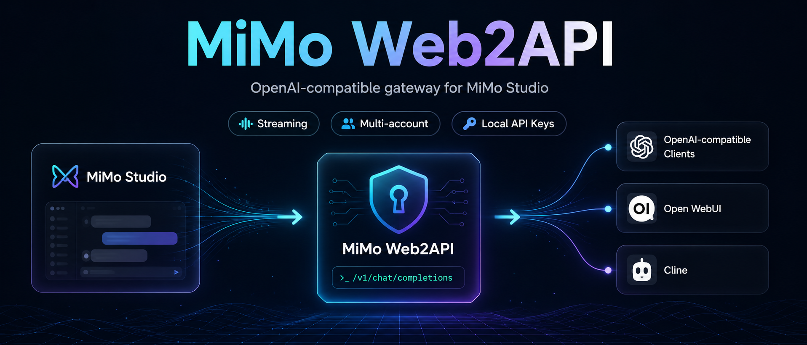

<div align="center">
  
  <h1>MiMo Web2API</h1>
  <p>
    <strong>OpenAI-compatible API gateway for Xiaomi MiMo Studio web sessions.</strong>
  </p>
  <p>
    <a href="#quick-start">Quick Start</a>
    ·
    <a href="#configuration">Configuration</a>
    ·
    <a href="#api-usage">API Usage</a>
    ·
    <a href="#tool-calling">Tool Calling</a>
    ·
    <a href="#license">License</a>
  </p>
  </p>
  <p>
    
    
    
    
  </p>
</div>

---

<p align="center">
  <code>MiMo Studio Cookie</code>
  <span>→</span>
  <code>MiMo Web2API</code>
  <span>→</span>
  <code>/v1/chat/completions</code>
  <span>→</span>
  <code>MimoCode / Open WebUI / Continue / Cline</code>
</p>

MiMo Web2API turns an authenticated `aistudio.xiaomimimo.com` browser session into a local OpenAI-compatible Chat Completions API. It is designed for clients that can talk to an OpenAI-style base URL but need to use MiMo Studio through a browser cookie/session.

> [!IMPORTANT]
> This project uses MiMo Studio's web endpoint. That endpoint is not a stable public API and can change without notice.

## Highlights

<table>
  <tr>
    <td><strong>OpenAI-compatible</strong></td>
    <td>Exposes <code>GET /v1/models</code> and <code>POST /v1/chat/completions</code>.</td>
  </tr>
  <tr>
    <td><strong>Streaming</strong></td>
    <td>Supports normal JSON responses and SSE streaming.</td>
  </tr>
  <tr>
    <td><strong>Multi-account</strong></td>
    <td>Loads multiple active MiMo accounts and uses simple round-robin selection.</td>
  </tr>
  <tr>
    <td><strong>Web dashboard</strong></td>
    <td>Manage credentials, local API keys, test accounts, chat, and inspect usage.</td>
  </tr>
  <tr>
    <td><strong>Reasoning support</strong></td>
    <td>Splits MiMo thinking markers and maps them to <code>reasoning_content</code>.</td>
  </tr>
  <tr>
    <td><strong>Tool execution</strong></td>
    <td>Detects several MiMo tool-call formats and can execute <code>bash</code> directly on the server.</td>
  </tr>
</table>

## Quick Start

### 1. Install

```bash
python3 -m venv venv
source venv/bin/activate
pip install -r requirements.txt
```

### 2. Run

```bash
PYTHONPATH=. uvicorn main:app --host 0.0.0.0 --port 8080 --reload
```

Or:

```bash
PYTHONPATH=. python main.py
```

The default local URL is:

```text
http://127.0.0.1:8080
```

### 3. Add a MiMo account

<ol>
  <li>Open <a href="https://aistudio.xiaomimimo.com/">aistudio.xiaomimimo.com</a> and sign in.</li>
  <li>Open browser DevTools and go to the <strong>Network</strong> tab.</li>
  <li>Send any message in MiMo Studio.</li>
  <li>Find the request to <code>/open-apis/bot/chat</code>.</li>
  <li>Use <strong>Copy as cURL</strong>.</li>
  <li>Open <code>http://127.0.0.1:8080/</code>.</li>
  <li>Paste the cURL command, parse it, test the account, then save.</li>
</ol>

Credentials are stored in `credentials.json`, which is ignored by git.

## Web Interfaces

<table>
  <thead>
    <tr>
      <th>Path</th>
      <th>Purpose</th>
    </tr>
  </thead>
  <tbody>
    <tr>
      <td><code>/</code></td>
      <td>Manage MiMo credentials and optional local API keys.</td>
    </tr>
    <tr>
      <td><code>/chat</code></td>
      <td>Local chat UI for quick model testing.</td>
    </tr>
    <tr>
      <td><code>/overview</code></td>
      <td>Usage dashboard grouped by account and model.</td>
    </tr>
    <tr>
      <td><code>/docs</code></td>
      <td>FastAPI OpenAPI documentation.</td>
    </tr>
  </tbody>
</table>

## Configuration

All environment variables use the `MIMO_` prefix.

<table>
  <thead>
    <tr>
      <th>Variable</th>
      <th>Default</th>
      <th>Description</th>
    </tr>
  </thead>
  <tbody>
    <tr>
      <td><code>MIMO_HOST</code></td>
      <td><code>0.0.0.0</code></td>
      <td>Host used by <code>python main.py</code>.</td>
    </tr>
    <tr>
      <td><code>MIMO_PORT</code></td>
      <td><code>8080</code></td>
      <td>Port used by <code>python main.py</code>.</td>
    </tr>
    <tr>
      <td><code>MIMO_API_KEY</code></td>
      <td>empty</td>
      <td>Optional bearer token required by <code>/v1/*</code>.</td>
    </tr>
    <tr>
      <td><code>MIMO_DEFAULT_MODEL</code></td>
      <td><code>mimo-v2.5-pro</code></td>
      <td>Fallback model when a caller sends an unknown model name.</td>
    </tr>
    <tr>
      <td><code>MIMO_CREDENTIALS_FILE</code></td>
      <td><code>credentials.json</code></td>
      <td>Local MiMo account store.</td>
    </tr>
    <tr>
      <td><code>MIMO_API_KEYS_FILE</code></td>
      <td><code>api_keys.json</code></td>
      <td>Local OpenAI-compatible API key store.</td>
    </tr>
    <tr>
      <td><code>MIMO_USAGE_FILE</code></td>
      <td><code>usage_stats.json</code></td>
      <td>Persistent local usage counters.</td>
    </tr>
  </tbody>
</table>

Enable bearer auth with an environment variable:

```bash
MIMO_API_KEY=sk-local-secret PYTHONPATH=. uvicorn main:app --host 0.0.0.0 --port 8080
```

You can also create and manage local API keys in the web UI. When `MIMO_API_KEY` is set or at least one local API key is active, `/v1/*` requires:

```http
Authorization: Bearer <key>
```

## Models

<table>
  <thead>
    <tr>
      <th>Model ID</th>
      <th>Notes</th>
    </tr>
  </thead>
  <tbody>
    <tr><td><code>mimo-v2.5-pro</code></td><td>Default model.</td></tr>
    <tr><td><code>mimo-v2.5</code></td><td>MiMo v2.5.</td></tr>
    <tr><td><code>mimo-v2.1-pro</code></td><td>MiMo v2.1 Pro.</td></tr>
    <tr><td><code>mimo-v2-pro</code></td><td>MiMo v2 Pro.</td></tr>
    <tr><td><code>mimo-v2-flash</code></td><td>Fast model, useful for account health checks.</td></tr>
  </tbody>
</table>

## API Usage

### List models

```bash
curl http://127.0.0.1:8080/v1/models \
  -H "Authorization: Bearer <key>"
```

If auth is not configured, omit the `Authorization` header.

### Chat completion

```bash
curl http://127.0.0.1:8080/v1/chat/completions \
  -H "Authorization: Bearer <key>" \
  -H "Content-Type: application/json" \
  -d '{
    "model": "mimo-v2.5-pro",
    "messages": [
      {"role": "user", "content": "Xin chao"}
    ],
    "temperature": 0.7
  }'
```

### Streaming

```bash
curl -N http://127.0.0.1:8080/v1/chat/completions \
  -H "Authorization: Bearer <key>" \
  -H "Content-Type: application/json" \
  -d '{
    "model": "mimo-v2.5-pro",
    "stream": true,
    "messages": [
      {"role": "user", "content": "Viet mot doan gioi thieu ngan"}
    ]
  }'
```

### Supported request fields

<table>
  <tr><td><code>model</code></td><td>Mapped to one of the MiMo model IDs above.</td></tr>
  <tr><td><code>messages</code></td><td>OpenAI-style system/user/assistant/tool messages.</td></tr>
  <tr><td><code>stream</code></td><td>Returns SSE chunks when true.</td></tr>
  <tr><td><code>temperature</code></td><td>Forwarded to MiMo as <code>temperature</code>.</td></tr>
  <tr><td><code>top_p</code></td><td>Forwarded to MiMo as <code>topP</code>.</td></tr>
  <tr><td><code>stop</code></td><td>Forwarded as stop sequences.</td></tr>
  <tr><td><code>thinking</code></td><td>Enables MiMo thinking mode when true.</td></tr>
  <tr><td><code>reasoning_effort</code></td><td>Also enables thinking mode.</td></tr>
  <tr><td><code>web_search</code></td><td>Maps to MiMo web search status.</td></tr>
</table>

## Tool Calling

> [!WARNING]
> `bash` tool calls are executed directly on the machine running this API. There is no sandbox. Do not expose this server to untrusted users.

When MiMo returns a recognized tool-call block, the server:

<ol>
  <li>Parses the tool call.</li>
  <li>Runs the <code>bash</code> command on the server.</li>
  <li>Adds the tool output back into the serialized conversation.</li>
  <li>Calls MiMo again to obtain the final assistant answer.</li>
</ol>

Runtime limits:

<table>
  <tr><td>Shell tools</td><td><code>bash</code>, <code>sh</code>, <code>shell</code>, <code>terminal</code>, <code>run_command</code></td></tr>
  <tr><td>Direct shell aliases</td><td><code>whoami</code>, <code>date</code>, <code>pwd</code>, <code>ls</code>, <code>uname</code>, <code>git</code>, <code>get_time</code></td></tr>
  <tr><td>File tools</td><td><code>read</code>, <code>read_file</code>, <code>glob</code>, <code>glob_files</code></td></tr>
  <tr><td>Timeout</td><td><code>120</code> seconds per command</td></tr>
  <tr><td>Output cap</td><td><code>20000</code> characters per tool result</td></tr>
  <tr><td>Max rounds</td><td><code>3</code> automatic tool rounds per request</td></tr>
</table>

Recognized formats include:

```xml
<tool_call>
<function=bash>
<parameter=command>echo "Tool system is working"</parameter>
<parameter=description>Test tool call</parameter>
</function>
</tool_call>
```

```xml
<tool_call>
{"name": "bash", "arguments": {"command": "whoami"}}
</tool_call>
```

```xml
<toolcall>
{"name": "bash", "arguments": {"command": "whoami"}}
</toolcall>
```

```xml
<tool_call>
<name>bash</name>
<arguments>
<command>whoami</command>
</arguments>
</tool_call>
```

When a command is executed, the server log includes:

```text
Executing bash tool call: <command>
```

## Management API

<table>
  <thead>
    <tr>
      <th>Endpoint</th>
      <th>Method</th>
      <th>Description</th>
    </tr>
  </thead>
  <tbody>
    <tr><td><code>/api/config</code></td><td><code>GET</code></td><td>Read configured MiMo credentials.</td></tr>
    <tr><td><code>/api/config</code></td><td><code>POST</code></td><td>Replace configured MiMo credentials.</td></tr>
    <tr><td><code>/api/parse-curl</code></td><td><code>POST</code></td><td>Parse browser cURL into URL, cookies, user-agent, and body.</td></tr>
    <tr><td><code>/api/test-account</code></td><td><code>POST</code></td><td>Check whether a MiMo credential can complete a request.</td></tr>
    <tr><td><code>/api/reload</code></td><td><code>POST</code></td><td>Reload credentials from disk.</td></tr>
    <tr><td><code>/api/usage</code></td><td><code>GET</code></td><td>Read local usage counters.</td></tr>
    <tr><td><code>/api/usage/reset</code></td><td><code>POST</code></td><td>Reset local usage counters.</td></tr>
    <tr><td><code>/api/access-keys</code></td><td><code>GET</code></td><td>List local API keys without exposing full secrets.</td></tr>
    <tr><td><code>/api/access-keys</code></td><td><code>POST</code></td><td>Create a local API key.</td></tr>
    <tr><td><code>/api/access-keys/{key_id}</code></td><td><code>PATCH</code></td><td>Enable or disable a key.</td></tr>
    <tr><td><code>/api/access-keys/{key_id}</code></td><td><code>DELETE</code></td><td>Delete a key.</td></tr>
  </tbody>
</table>

## Local Files

<table>
  <thead>
    <tr>
      <th>File</th>
      <th>Purpose</th>
      <th>Commit?</th>
    </tr>
  </thead>
  <tbody>
    <tr><td><code>credentials.json</code></td><td>MiMo cookies and request metadata.</td><td>No</td></tr>
    <tr><td><code>api_keys.json</code></td><td>Local bearer keys for <code>/v1/*</code>.</td><td>No</td></tr>
    <tr><td><code>usage_stats.json</code></td><td>Persistent usage counters.</td><td>No</td></tr>
  </tbody>
</table>

## Testing

```bash
PYTHONPATH=. ./venv/bin/pytest -q
```

Without the repository virtualenv:

```bash
PYTHONPATH=. pytest -q
```

## Limitations

- MiMo Studio's web endpoint can change response formats without notice.
- OpenAI message history is serialized into one MiMo query because the web endpoint manages conversation state differently.
- Image content parts are currently ignored; text parts are preserved.
- `max_tokens`, penalties, and some OpenAI parameters are accepted for compatibility but may not be fully honored upstream.
- Tool execution depends on MiMo producing one of the recognized tool-call formats.

## Security Notes

<ul>
  <li>Do not commit <code>credentials.json</code>, <code>api_keys.json</code>, or <code>usage_stats.json</code>.</li>
  <li>Use <code>MIMO_API_KEY</code> or local API keys before exposing the server beyond localhost.</li>
  <li>Put the service behind a reverse proxy or firewall for remote access.</li>
  <li>Remember that auto-executed <code>bash</code> commands run with the same permissions as the API process.</li>
</ul>

## License

Released under the [MIT License](LICENSE).
